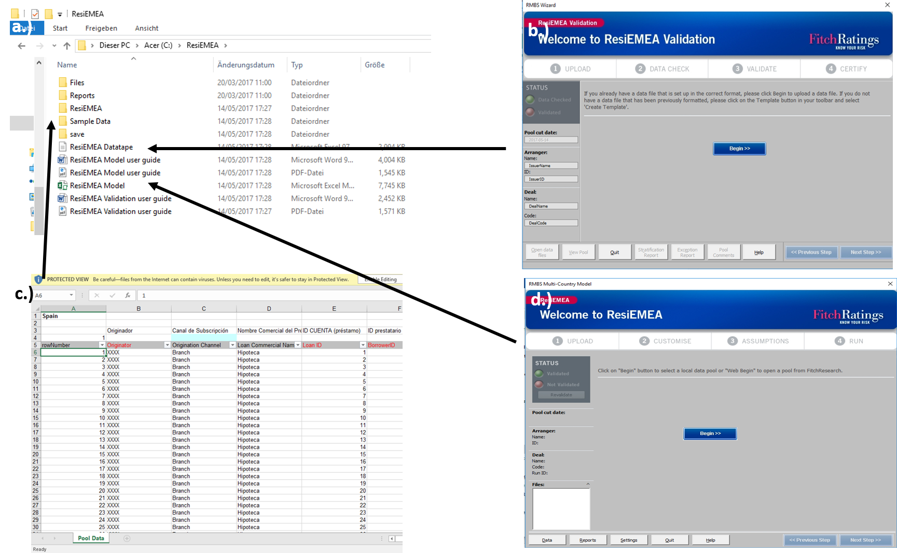

# (PART) Statistical Modelling {-}
# Microsoft Analytics Tool {#Research}

Have you seen the film the "Big Short"? It is a great movie and highlights many major failings of the US sub-prime mortgage industry. The main villains are the fast living, money grabbing Investment bankers from New York. However the Credit Rating Agencies, quasi-governmental organisations manadated to defend investors from poor quality investments, were revealed as partners in crime.

Rating Agencies are weird businesses. If you imagine the the glitzy sky-scraper offices of Investment Banks then you are also correctly picturing a Rating Agency. But unlike Investment Banks which rely on the best brains to continuously generate new business, Rating Agencies do not generate any new business. They simply provide a financial health check service which is a legal requirement for many Institutional Investors.

So the story I want to guide you through goes something like this. A mortgage is a very large loan made by a lending business to individuals purchasing a home. The mortgage typically represents 3-5 times the salary of the borrower and can take up to 50 years to repay! Investors in mortgage lending businesses are clearly motivated to make sure these repayments happen. To this end, they can obtain a financial health check from a Rating Agency. What has this got to do with Microsoft Analytics tools?

One of the "Big Three Credit Ratings Agencies" a company called Fitch Ratings Inc developed a health check tool. They wanted to provide a free-to-download tool that runs on the Microsoft Excel desktop-package. Their objective was to make the tool perform the complex calculations so that the user can focus on their investment questions: can the customer afford to repay his loan and what is the resale value of the property. OK! But why do we care about this tool?

Whilst not every Microsoft analytics tool looks like what follows. I am putting this tool under the spotlight as a "best in class" Microsoft product. Why? Well, if you imagine a financial servicse company making a huge amount of cash and employing over 2000 analysts, then its models should be be pretty high quality. Right?

On its website Fitch describes its tool as:

-    The tool provides "An Analytical model that helps with the risk assessment of Residential Mortgage loans". 
-    The "sustainable home price model" is used to determine the true value of a property. A sustainable long-term house price is calculated based on six key drivers identified through regression anaysis on a data-set from 1976-2011.
-    The "Probability of Default model" uses a regression-based analysis to estimate the probability that a customer stops making payments. There are 13 independent variables in the model, 11 individual loan and borrower attributes and one related to economic risk factors. The model is based on data from 1991-2009.

When you click download, you'll get a zip file containing how-to documentation and a Microsoft Excel file containing the tool. 

Clearly when dealing with business users, achieving user acceptance is as important as model sophistication. You can see in figure xx that Fitch achieved this: 

(ref:ResiEMEA1) A screenshot of what the downloaded .zip file contains. Figure a.) Shows the individual files including user guides but also two excel tools. b.) The Datatape tool c.) The data template and d.) The Model tool

```{r,echo=FALSE, fig.cap='(ref:ResiEMEA1)'}

```


For business users with limited I.T. credentials, an Excel desktop tool requires installing no new software nor specialist training. It also contains no external data links so there are no issues regarding data security. Whilst the download does contain easy to read documentation, the tool guides the user through the analysis in a self-explanatory way using a pop-up "wizard" application.

As with all calculation engines, Fitch's tool requires data in a specific format. If you look at the figures xx xx, you will see a number of data validation and certification steps. 

(ref:ResiEMEA2) Screenshots of the wizard guiding the user through four data validation steps

```{r,echo=FALSE, fig.cap='(ref:ResiEMEA2)'}
knitr::include_graphics("Analysis/Images/ResiEMEA2.png")
```


This is actually the reason why a pop-up wizard was required.Unfortunately there is no inbuilt wizard within Microsoft Desktop products and an enhancement is required to create one. This requires the support of a software development.

I mentioned above that there are two key models in the tool. The "sustainable home price model" calculates property resale values. Whilst this was sold to us as a "regression model" using six factors, it ends up being an accounting based calculation with just two adjustments! What has gone wrong?

(ref:ResiEMEA3) Screenshot of the resale value calculation

```{r,echo=FALSE, fig.cap='(ref:ResiEMEA3)'}
knitr::include_graphics("Analysis/Images/ResiEMEA3.png")
```


I think the critical flaw in this tool is a reliance on software developers to build the Wizard. For sure the professional looking and robust tool is a credit to the quality of the software team. Business users would never have been able to specify something so clean, nor would the analytics team ever have had the skills to build it! 

However building successful analytics tools takes many iterations and much time. You will never get correctly specified requirements from business users until they have seen the first product release! Software developers are precious resources which are either no longer available or too expensive for these later iterations. So all you ever get is a first release and in this case the calculation engine was highly simplified!  

Lets re-cap. We started with technical documentation describing a regression based calculation engine. This engine was wrapped up in a desktop tool "Microsoft Excel" for user acceptance purposes. A data validation process is a key preliminary step to running the model and a custom wizard guides users through this process. This wizard would have been built by a software development team. Finally we reviewed the "home price" calcualtion component and found that it was much less sophiticated than we were expecting. A reliance on specialised software developers was identified as a cause of this simplification.


## Research Methodology

My goal was to use a multiple linear regression model to accurately predict house prices. The starting point of my research was a sample data set from the website [kaggle](). The data contains property sales prices for transactions between May 2014 and May 2015 in King County USA which includes Seattle.

I started my research project by reviewing online literature on house price prediction. This "meta analysis" had two purposes:

- It helped select variables to include in the model 
- It added credibility to my findings if I incorporated and built on the empirical evidence of previous research studies

I performed significant data-enrichment activities. This involved API calls to the online repositories [Google]() and [Zillow](). My goal was to append to the data-set certain key variables identified in the "meta analysis".

I performed several formal model selection procedures. This involved:

- Variable selection
- Model fitting
- Diagnostics
- Selection between competing models

I evaluated model performance on a "hold-out sample" representing 20% of the original data-set. Model performance was evaluated through evaluating "out of sample" prediction accuracy.

## Meta Analysis/Literature Review

My data set from [Kaggle]() only included information on **micro variables**. These *micro variables* related to the intrinsic features of a property and its immediate environment. By contrast, *macro variables* were excluded. These relate to the "external environment" of the property (see examples below). 

By excluding macro variables, the parameter estimates of my model could be **biased**. For example, the data comes from the period from May 2014 to May 2015 when the external environment in the US was relatively stable. This means that the level of noise in the data could be artificially low and the explanatory power of micro variables overstated.

To mitigate this risk I performed a quick online literature search and identified micro variables which previous research studies have found to be significant predictors of property price. I have included these variables as the starting point of the model selection process in Section \@ref(Classical). This should lead as much overlap as possible between my model and previous studies and stops me relying 100% on a statistical model selection procedure which is vulnerable to bias.

In Section \@ref(CompSci), I take a more pro-active approach to dealing with potential bias. I use the results of a data-enrichment exercise to extend my original data-set to include **macro variables**. Furthermore these macro variables are exactly those which previous studies found to be significant predictors of property prices. 

#### Micro variable Examples

- Building features
- Interior Layout and Size
- Quality of fixture and fittings

#### Macro variable Examples

- Nearby amenities
- Cost of mortgage borrowing in the area
- unemployment levels in the job market
- demographics 

#### Results of online search

The table below shoes the micro-variables identified online, the reference article and the matching field in the database. Article 1 is [@galati2011macro], Article 2 is [@candas2015], Website 1 is [@rightmove]


|Micro-variable         | Reference | Data-Set Field  |
|-----------------------|:---------:|-----------------|
|Year of Construction   | Article 1 |Construction Year|
|Size of Living Room    | Article 1 |Living Space     |
|Presence of Garage     | Article 1 |                 |
|Presence of Garden     | Article 1 |                 |
|Type of House          | Article 1 |Number of Floors |
|Large City vs not large| Article 1 |Seattle ZipCode  |
|Degree of Urbanization | Article 1 |                 |
|Floor No               | Article 2 |Floors           |
|Heating System         | Article 2 |Renovation Year  |
|Earthquake Zone        | Article 2 |                 |
|Rental Value           | Article 2 |                 |
|Land Value             | Article 2 |                 |
|Parcel Area            | Article 2 |Total Area       |
|Zoning                 | Article 2 |Zipcode          |
|Proximity to Amenities | Website 1 |                 |
|Number of Bedrooms     | Website 1 |Bedrooms         |
|Number of Bathrooms    | Website 1 |Bathrooms        |
|Age of Building        | Website 1 |                 |
|Condition of Interior  | Website 1 |Condition/Grade  |

