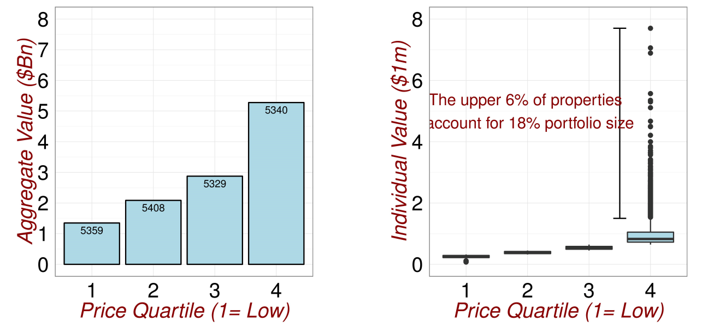
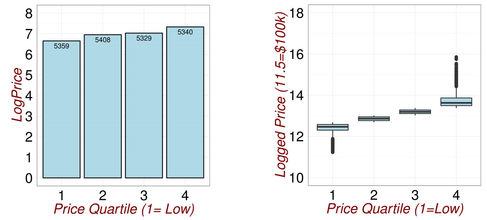
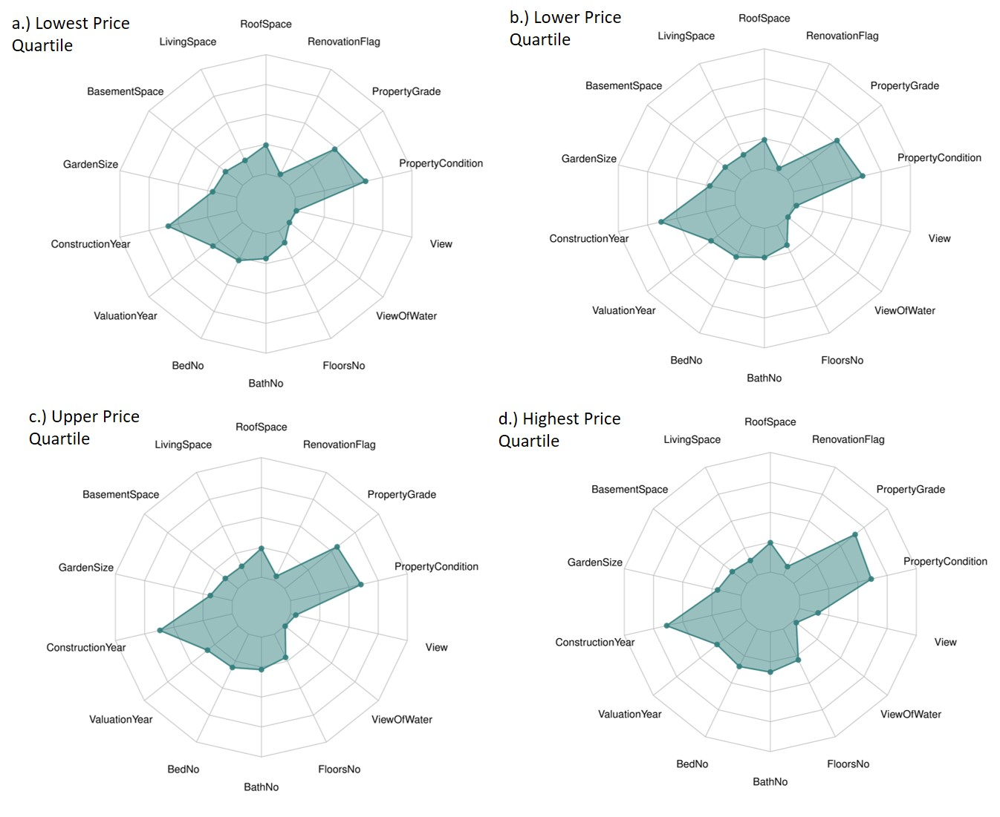
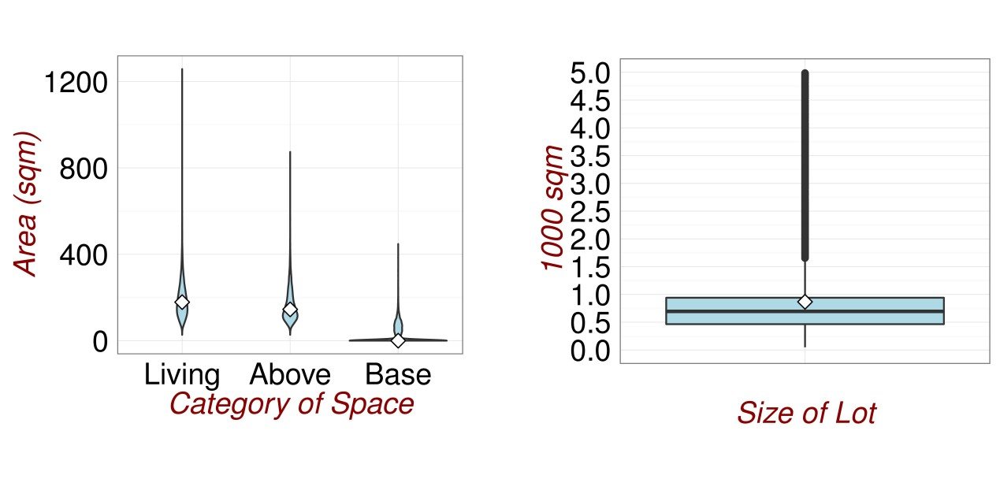
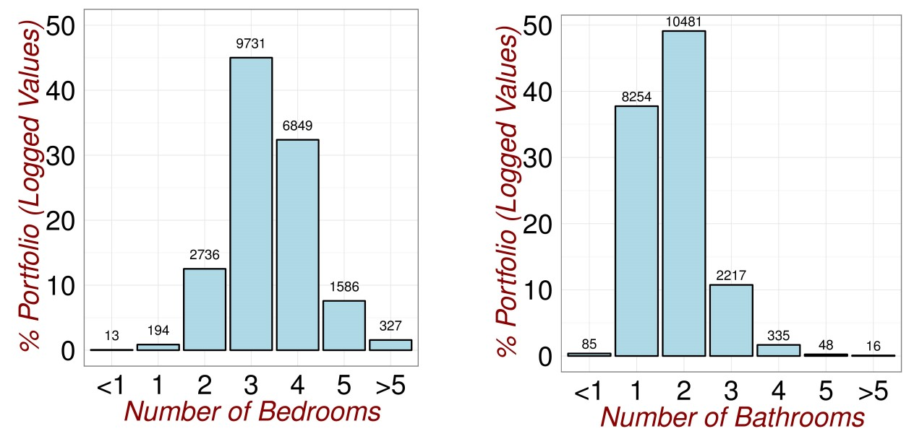
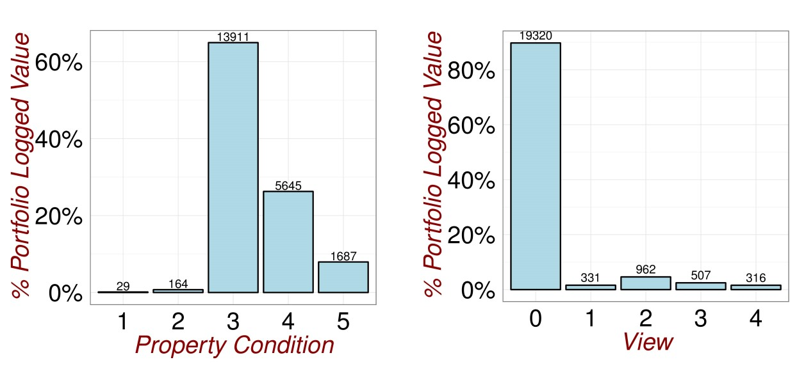
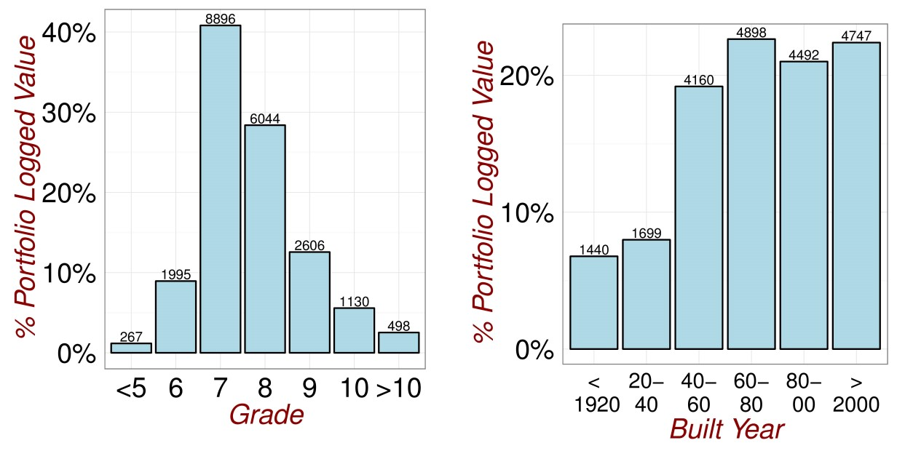
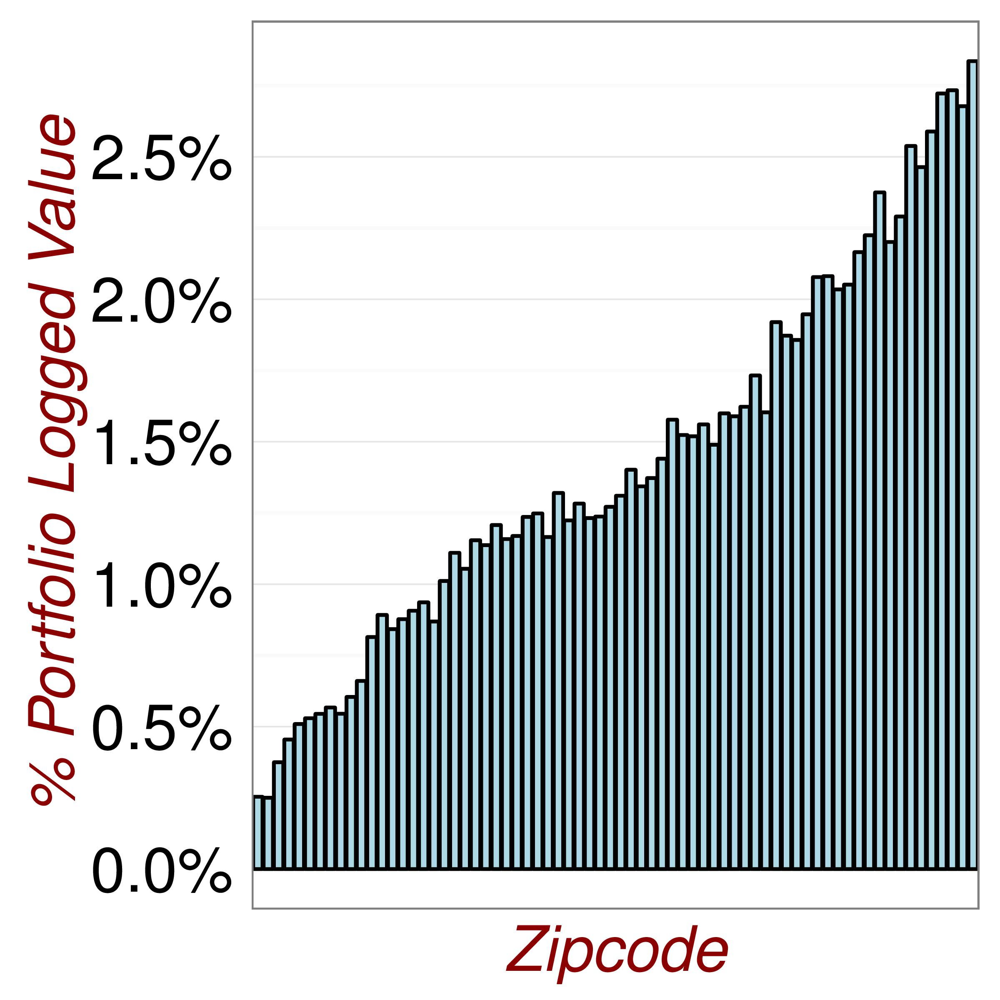
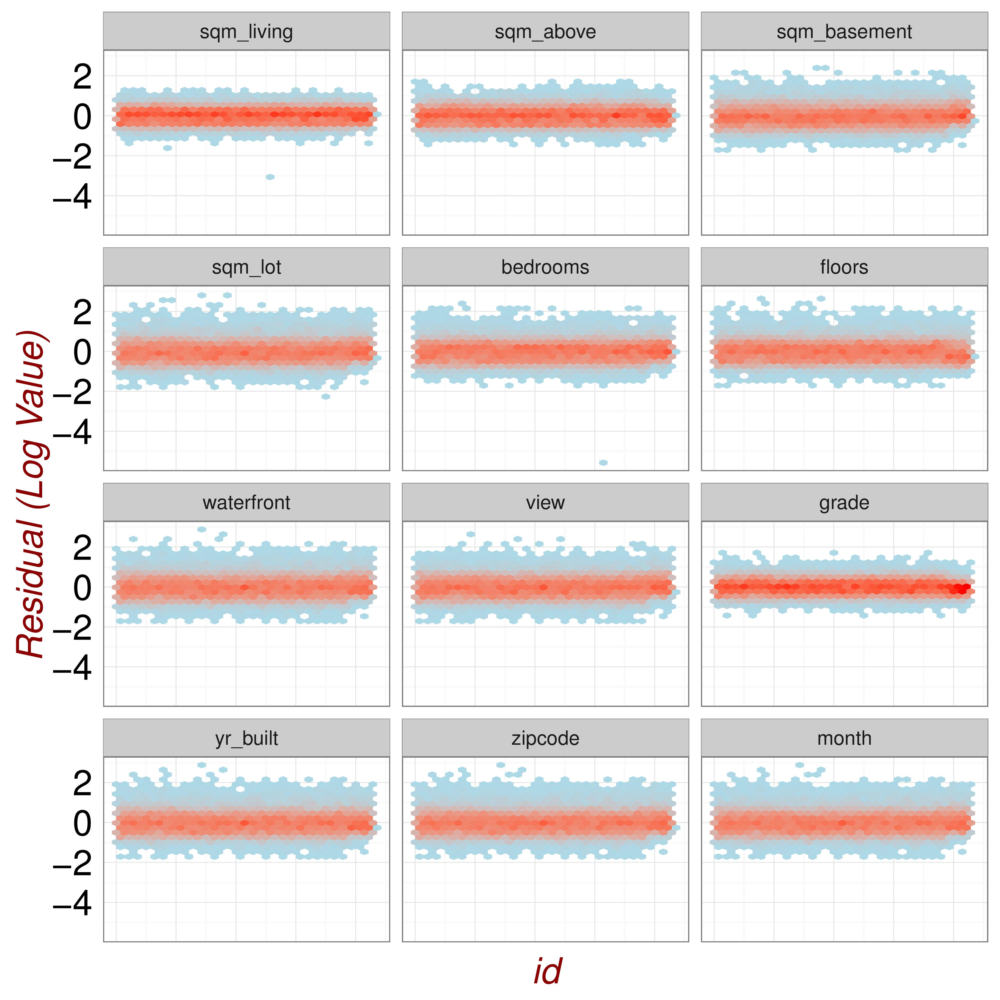
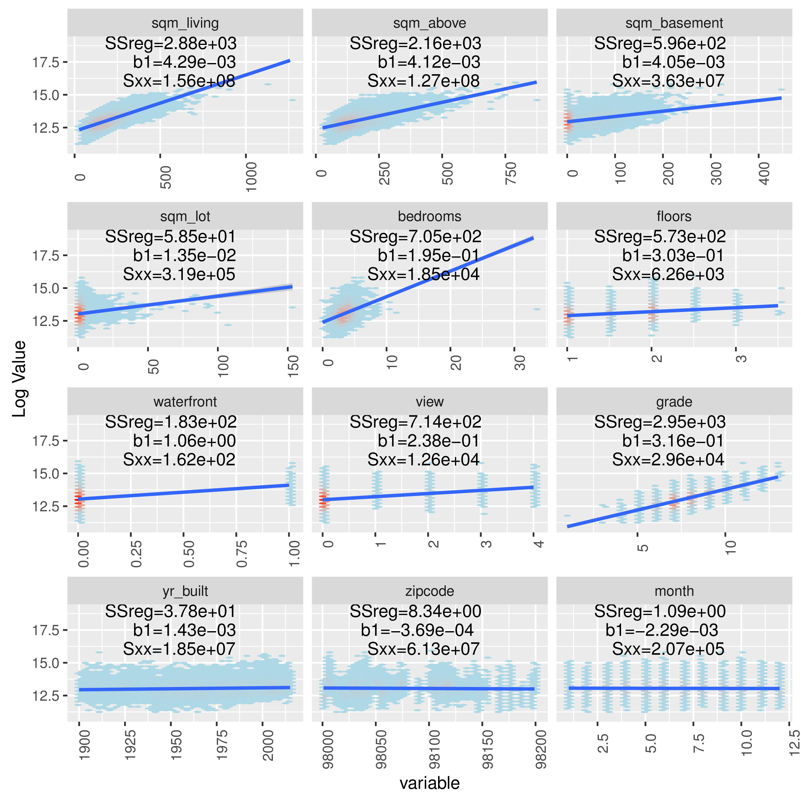

# Computer Science Approach

(ref:Outliers1) Checking for Outliers.

```{r Outliers1,echo=FALSE, fig.cap='(ref:Outliers1)',fig.align='center'}

```

(ref:Outliers1) Adjusting for Outliers.

```{r Outliers2,echo=FALSE, fig.cap='(ref:Outliers1)',fig.align='center'}

```

(ref:Visualisation1) Looking for Relationships.

```{r Outliers3,echo=FALSE, fig.cap='(ref:Outliers1)',fig.align='center'}

```

(ref:DataExploration1) Revisiting the Data.

```{r DataExploration1,echo=FALSE, fig.cap='(ref:DataExploration1)',fig.align='center'}




knitr::include_graphics("Analysis/Images/Exploratory3.jpg")

knitr::include_graphics("Analysis/Images/Exploratory4.jpg")





```

```{r DataExploration2,echo=FALSE, fig.cap='(ref:DataExploration1)',fig.align='center',out.width='40%'}

```


(ref:ModelFit1) Looking for Poor Model Fit.

```{r ModelFit1,echo=FALSE, fig.cap='(ref:ModelFit1)',fig.align='center'}

```

(ref:ModelFit2) Looking for Poor Model Fit.

```{r ModelFit2,echo=FALSE, fig.cap='(ref:ModelFit2)',fig.align='center'}

```
