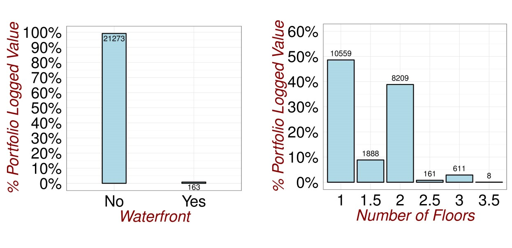

# Computer Science Approach

(ref:Interactions) Improving the model

```{r setup, include=FALSE}
library(dplyr)
library(xtable)
library(MASS)
library(texreg)

#Read the datafile
data2<-read.table(file="Analysis/Data/HousePriceData.csv",header=TRUE,sep=",",stringsAsFactors = TRUE)

options("xtable.type"="html")

```

```{r ModelFitting,echo=FALSE}

#Some data manipulation to convert factors to numeric
data3<-data2

#Rename a Variable
data3<-rename(data3,
              AboveGroundFloorArea=AboveGroundFloor,
              Condition=condition,
              Grade=grade)

#Reclassify a factor
data3$RenovationFlag<-as.numeric(levels(data2$RenovationFlag)=="Yes")[data2$RenovationFlag]
data3$SeattleFlag<-as.numeric(levels(data2$SeattleFlag)=="Yes")[data2$SeattleFlag]

#Subset the dataframe
data3<-subset(data3,select=c(ConstructionYear,
                      LivingSpace,
                      NumberOfFloors,
                      SeattleFlag,
                      RenovationYear,
                      TotalArea,
                      NumberOfBedrooms,
                      NumberOfBathrooms,
                      Condition,
                      Grade,
                      AboveGroundFloorArea,
                      BasementSize,
                      SaleMonth,
                      View,
                      RenovationFlag,
                      WaterfrontView,
                      SaleYear,
                      LogSalePrice
                      ))

# Fit the Base Model (Model 1)

fit1<-lm(LogSalePrice ~
        ConstructionYear+
        LivingSpace+
        NumberOfFloors+
        SeattleFlag+
        RenovationYear+
        TotalArea+
        NumberOfBedrooms+
        NumberOfBathrooms+
        Condition+
        Grade,data=data3)

# Fit the Enhanced Model (Model 6)

data3$FlatFlag<-as.factor((data3$NumberOfFloors<2)*1)

fit2<-lm(LogSalePrice ~
        (ConstructionYear+
        LivingSpace+
        NumberOfFloors+
        SeattleFlag+
        RenovationYear+
        TotalArea+
        NumberOfBedrooms+
        NumberOfBathrooms+
        Condition+
        Grade)*FlatFlag,data=data3)


```

```{r, echo=FALSE}
formula(fit2)
```


```{r ModelChecking, echo=FALSE}
#Analysis of Variabe

a<-anova(fit1,fit2)

b<-data.frame(Model=c("Fit1","Fit2"),
              DoF=a$Res.Df,
              RSS=round(a$RSS,0),
              "DOF_Diff"=a$Df,
              SUmOfSq=a$`Sum of Sq`,
              FProb=round(a$`Pr(>F)`,2))

table2<-xtable(b,
               caption="Statistical Test Model 5 vs Model 1")


```

```{r PrintTable, echo=FALSE,warning=FALSE, error=FALSE, results='asis'}
print.xtable(table2,caption.placement="bottom")

```


(ref:Outliers1) Checking for Outliers.

```{r Outliers1,echo=FALSE, fig.cap='(ref:Outliers1)',fig.align='center'}
knitr::include_graphics("Analysis/Images/Visualization1.png")
```

(ref:Outliers1) Adjusting for Outliers.

```{r Outliers2,echo=FALSE, fig.cap='(ref:Outliers1)',fig.align='center'}
knitr::include_graphics("Analysis/Images/Vizualisation2.jpg")
```

(ref:Visualisation1) Looking for Relationships.

```{r Outliers3,echo=FALSE, fig.cap='(ref:Outliers1)',fig.align='center'}

```

(ref:DataExploration1) Revisiting the Data.

```{r DataExploration1,echo=FALSE, fig.cap='(ref:DataExploration1)',fig.align='center'}
knitr::include_graphics("Analysis/Images/Exploratory1.jpg")




knitr::include_graphics("Analysis/Images/Exploratory4.jpg")

knitr::include_graphics("Analysis/Images/Exploratory5.jpg")

knitr::include_graphics("Analysis/Images/Exploratory6.jpg")

```

```{r DataExploration2,echo=FALSE, fig.cap='(ref:DataExploration1)',fig.align='center',out.width='40%'}
knitr::include_graphics("Analysis/Images/Exploratory7.jpg")
```


(ref:ModelFit1) Looking for Poor Model Fit.

```{r ModelFit1,echo=FALSE, fig.cap='(ref:ModelFit1)',fig.align='center'}
knitr::include_graphics("Analysis/Images/Plot25.jpg")
```

(ref:ModelFit2) Looking for Poor Model Fit.

```{r ModelFit2,echo=FALSE, fig.cap='(ref:ModelFit2)',fig.align='center'}

```
